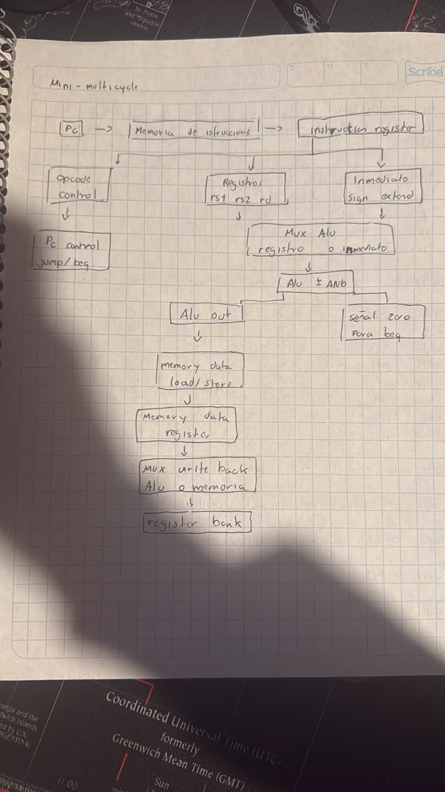
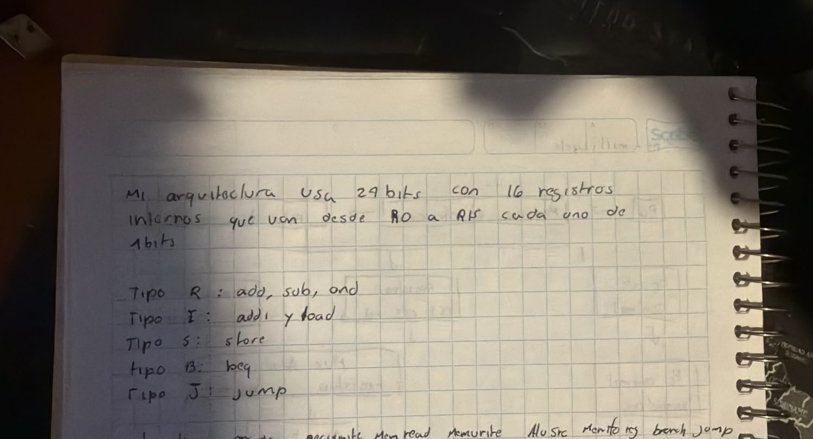
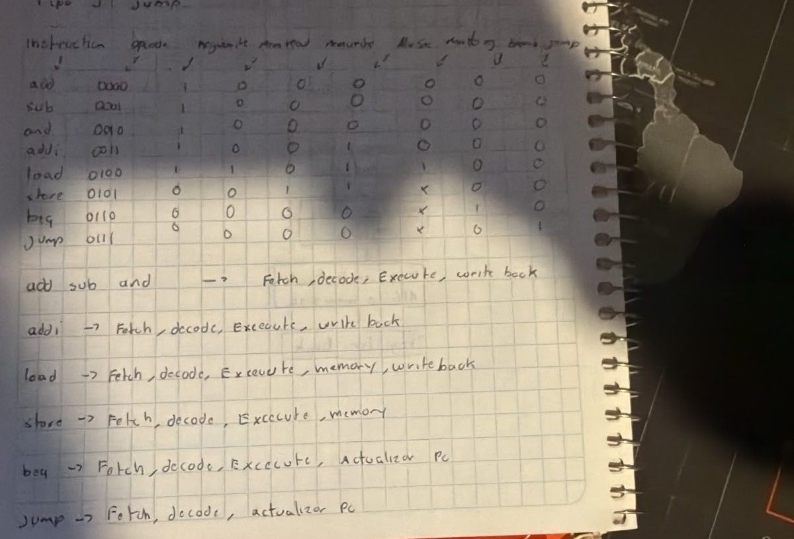

1.	Diagrama a bloques: Representación visual de tu arquitectura (Single-cycle, Multi-cycle o Pipelined). Indica claramente las unidades funcionales.

 
2.	Formato de Instrucción: Define cómo se dividen los bits de tu palabra de instrucción. Justifica el tamaño total de la instrucción.

 

3.	Decodificación

 

4.	Interacción entre bloques
Primero, el PC indica dónde está la siguiente instrucción. Esa dirección va a la memoria de instrucciones y la instrucción se guarda en el IR.

Después, la unidad de control revisa qué instrucción es: add, sub, and, addi, load, store, beq o jump.

Para add, sub y and, el banco de registros entrega dos valores. Luego la ALU hace la operación:

add: suma dos registros.
sub: resta dos registros.
and: hace una operación lógica AND entre dos registros.

Para addi, la ALU suma un registro con un número inmediato. Es decir:

addi = registro + inmediato

Para load, la ALU calcula una dirección de memoria usando un registro base y un inmediato. Luego la memoria de datos entrega el dato, pasa por el MDR y finalmente se guarda en un registro.

Para store, la ALU también calcula una dirección, pero en vez de leer memoria, guarda en memoria el valor que viene de un registro.

Para beq, la ALU compara dos registros. Si son iguales, el PC cambia a la dirección del salto.

Para jump, no se comparan registros. El PC simplemente cambia a otra dirección.

5.	Optimización: Propón al menos una mejora o técnica de optimización y argumenta por qué sería efectiva para tu diseño.
La mejora de mi diseño es usar instrucciones de 24 bits en lugar de 32 bits.Esto sirve porque mi procesador solo usa pocas instrucciones: load, store, jump, add, sub, and, addi y beq. Entonces no necesita una instrucción tan grande como RISC-V completo.
Con instrucciones más pequeñas, se usa menos memoria y la unidad de control puede ser más simple. Además, como solo uso 16 registros, cada registro necesita menos bits dentro de la instrucción.
Otra mejora es que la arquitectura sea multiciclo, porque así se pueden reutilizar los mismos bloques. Por ejemplo, la ALU sirve para hacer add, sub, and, también para addi, para calcular direcciones en load y store, y para comparar registros en beq.
