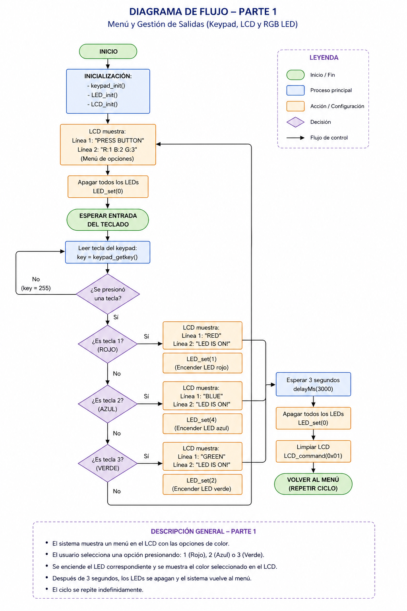
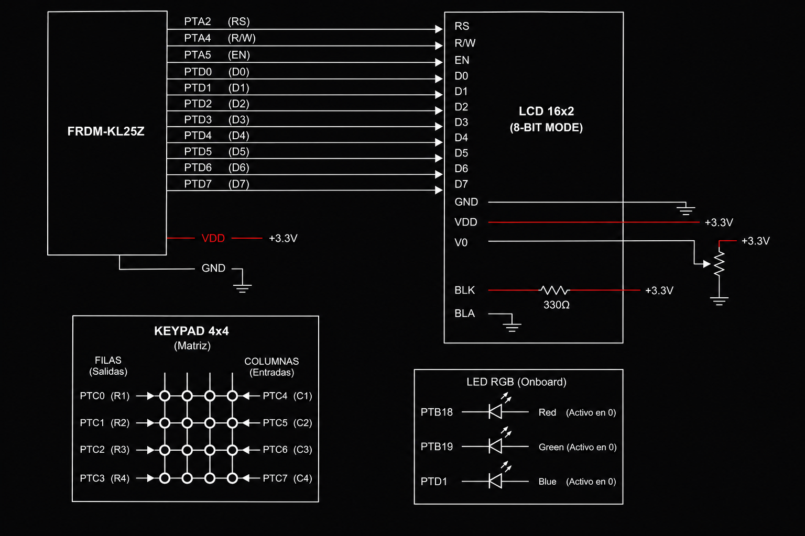
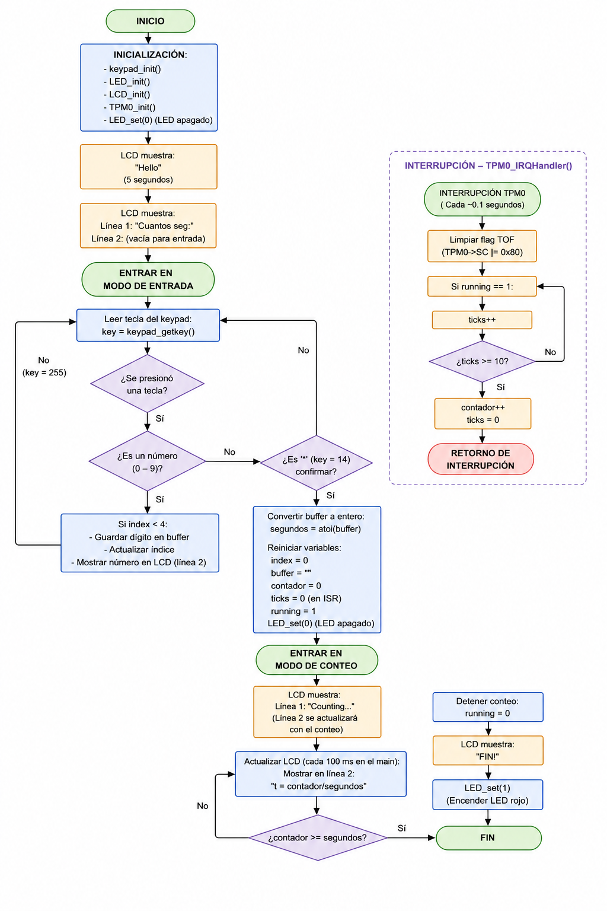

# SoC Practice: Timer and Menu System with Keypad, LCD and TPM0  
## Andre - Santi - Jared - Joshua  

This project implements a configurable timer system using a keypad for user input, an LCD for real-time visualization, and the TPM0 module for accurate time counting. Additionally, it includes a **menu-based LED control system**, allowing the user to select RGB LED colors directly from the keypad.

---

## Materials Used

To replicate this project, the following hardware is required:

* **Microcontroller:** KL25Z  
* **Display:** LCD (16x2) operating in **8-bit mode**  
* **Input:** 4x4 Matrix Keypad  
* **Output:** Onboard RGB LED (used as indicator)  
* **Extra Components:** Breadboard, jumper wires, resistor  

---

## System Features

### Timer System
* **User Input via Keypad:** Allows entering either 1 or 2 digit values (seconds).  
* **Dynamic Display:** LCD shows prompts, user input, and real-time countdown.  
* **Hardware Timer:** Uses TPM0 interrupts for accurate time tracking (1 second resolution).  
* **State Control:** System switches between input mode, counting mode, and finished state.  
* **Visual Indicator:** LED turns ON when countdown finishes.  

---

### Menu-Based LED Control
* Displays a menu on the LCD:
   * Show:
   ```
   PRESS BUTTON
   R:1 B:2 G:3
   ```
* User selects LED color:
* `1` → Red  
* `2` → Blue  
* `3` → Green  
* LCD updates to show selected color  
* LED turns ON for a few seconds  
* System returns to menu automatically  

---

### General
* Keypad input with debouncing  
* LCD real-time updates  
* RGB LED control using GPIO  
* Interrupt-based timing (efficient and precise)  

---

## Architecture and Pin Mapping

### Keypad - Port C

* **Rows (Outputs):** `PTC0` – `PTC3`  
* **Columns (Inputs):** `PTC4` – `PTC7`  
* Configured with pull-up resistors for scanning  

---

### LCD Screen - Ports A and D (8-Bit Mode)

* **Data Bus (8 bits):** `PTD0` – `PTD7`  
* **Control Pins:**
* **RS:** `PTA2`  
* **R/W:** `PTA4`  
* **EN:** `PTA5`  

---

### RGB LED - Ports B and D

* **Red:** `PTB18`  
* **Green:** `PTB19`  
* **Blue:** `PTD1`  

> Note: LED operates with inverse logic (LOW = ON).

---

### Timer Module

* **TPM0:** Generates periodic interrupts (~0.1 seconds per overflow)  

---

## Execution Flow

### Timer System

1. **Initialization:**
 * Initialize keypad, LCD, LED, and TPM0  
 * Turn off LED  
 * Display welcome message `"Hello"`  
 * Prompt user with `"Cuantos seg:"`  

2. **User Input:**
 * User enters digits via keypad  
 * Input is stored in a buffer (1–2 digits)  
 * LCD updates dynamically  

3. **Start Countdown:**
 * User presses `'*'` to confirm  
 * Convert input using `atoi`  
 * Reset counter and start timer  
 * Display `"Counting..."`  

4. **Counting Process:**
 * TPM0 interrupt increments ticks  
 * Every 10 ticks → 1 second  
 * Increase `contador`  

5. **Display Update:**
 * Show:
   ```
   t = current / total
   ```

6. **Finish Condition:**
 * If `contador >= segundos`:
   * Stop timer  
   * Display `"FIN!"`  
   * Turn ON LED  

---

### Menu System

1. Display menu on LCD  
2. Wait for key input  
3. Detect selection:
 * `1` → Red  
 * `2` → Blue  
 * `3` → Green  
4. Display selected color  
5. Turn ON LED  
6. Wait a few seconds  
7. Turn OFF LED  
8. Return to menu  

---

## System Behavior

* User interacts via keypad  
* LCD provides continuous feedback  
* Timer runs independently using interrupts  
* LED indicates both timer completion and menu selection  

---

## System Flowchart

Below is the flowchart illustrating the system behavior:
## PT1




## PT2



---
